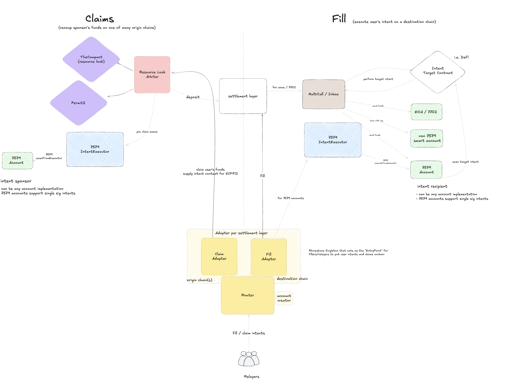
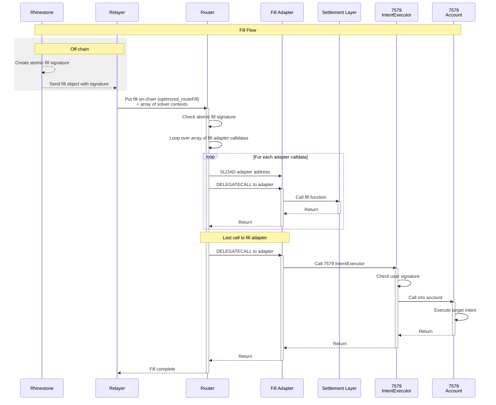
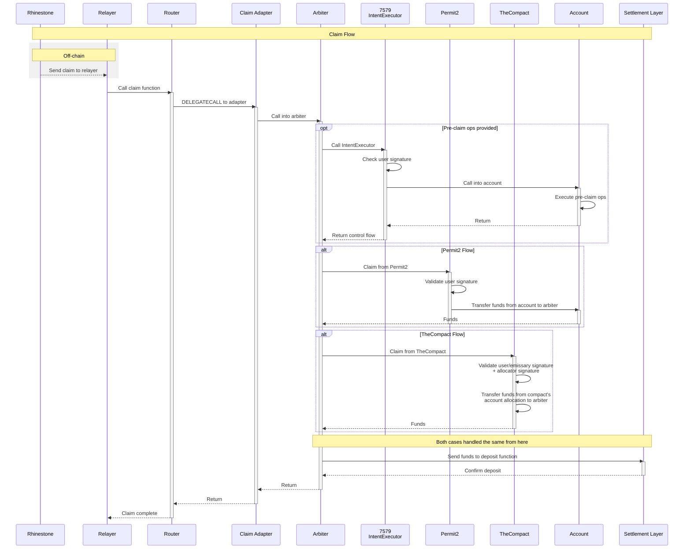

# Warp Routerr

A modular, gas-optimized settlement routing system for cross-protocol and cross-chain operations.

## Overview

The Warp Routerr is a sophisticated settlement orchestration system that enables atomic execution of complex DeFi operations across multiple protocols. It provides a unified interface for solvers and relayers to execute trades, manage liquidity, and settle orders through various settlement layers including TheCompact, Permit2, and cross-chain bridges.

## Architecture

The Warp Routerr implements a modular, delegatecall-based architecture that separates routing logic from protocol-specific settlement implementations. This design enables seamless integration of new protocols while maintaining consistent security guarantees and gas optimizations across all settlement types.



The architecture consists of three primary layers:
- **Router Layer**: Handles operation routing, batching of settlemnt layers, and enforcement of atomicity
- **Adapter Layer**: Protocol-specific settlement logic executed via delegatecall
- **Arbiter Layer**: Validates and unlocks user resources for settlement

### Fill Flow



### Claim Flow



### Core Components

#### 1. Router (`RouterLogic.sol` & `RouterManager.sol`)

The Router system serves as the central coordination hub for all settlement operations. It combines execution logic (RouterLogic) with adapter lifecycle management (RouterManager) to provide a complete routing solution. The system implements a delegatecall-based adapter pattern where different protocols can be plugged in as adapters while maintaining consistent routing logic and security guarantees.

**Key Features:**
- **Atomic Intent Processing**: Ensures multiple operations execute atomically or revert entirely
- **Gas Optimization**: Advanced caching mechanisms reduce gas costs by 20-40% for batch operations
- **Signature Validation**: All fill operations require cryptographic signatures from authorized signers
- **Adapter Caching**: Consecutive operations using the same adapter reuse cached addresses, saving ~2100 gas per cache hit
- **Semantic Versioning**: Enforces version compatibility for safe adapter upgrades
- **Hotfix Support**: Allows patch-only upgrades for critical fixes
- **Role-Based Access**: Separate roles for adding (ADD_ROLE) and removing (RM_ROLE) adapters
- **Atomic Fill Signer Management**: Can pause all fill operations by setting signer to address(0)

**Operation Types:**
- **Fill Operations**: Settlement operations that fulfill user orders by transferring assets. Require atomic signature validation.
- **Claim Operations**: Resource unlock operations that claim user assets from protocols. Can be executed independently.

#### 2. Adapters (`AdapterBase.sol`)

Adapters are protocol-specific contracts that handle the actual settlement logic for different protocols and chains. They are always executed via delegatecall from the Router, inheriting its storage context and permissions.

**Critical Security Notes:**
- Adapters execute in the Router's context via delegatecall
- Never make direct calls to untrusted external contracts
- All fill/claim functions must return their own function selector
- Must implement ERC165 interface detection

**Adapter Implementation Requirements:**
```solidity
// All adapter functions must follow this pattern:
function myFillOperation(...) external returns (bytes4) {
    // Settlement logic here
    return this.myFillOperation.selector;
}

// Must implement interface detection:
function supportsInterface(bytes4 interfaceId) public pure override returns (bool) {
    return interfaceId == this.myFillOperation.selector || 
           super.supportsInterface(interfaceId);
}
```

#### 3. Arbiters (`ArbiterBase.sol`)

Arbiters are responsible for validating settlements and unlocking funds from user accounts or resource locks. They provide dual protocol support for both TheCompact and Permit2 standards.

**Responsibilities:**
- Execute pre-claim operations before settlement
- Compute mandate hashes for protocol validation
- Maintain Router-only access control
- Orchestrate settlement flow for multiple protocols

## Integration Guide for Solvers/Relayers

### Understanding Solver Context

The solver context is a critical component that allows solvers to pass settlement-specific data to adapters. It's appended to adapter calldata and can be extracted using the `_loadrelayerContext()` helper function.

#### Solver Context Format

When the Router calls an adapter, it appends the solver context using:
```solidity
abi.encodePacked(adapterCalldata, relayerContext, uint256(relayerContext.length))
```

Resulting calldata structure:


#### Example: SameChainAdapter Solver Context

The SameChainAdapter demonstrates a simple but critical use of solver context - specifying where input tokens should be sent:

```solidity
// SameChainAdapter expects solver context to be:
// abi.encodePacked(address tokenInRecipient)

// In the adapter:
function _tokenInRecipient() internal pure returns (address tokenInRecipient) {
    bytes calldata relayerContext = _loadrelayerContext();
    // The first 20 bytes are the tokenIn recipient address
    return address(bytes20(relayerContext[:20]));
}

// Usage in fill operations:
function samechain_compact_handleFill(FillDataCompact calldata fillData) 
    external payable onlyViaRouter returns (bytes4) 
{
    // Extract the solver's recipient address for input tokens
    address tokenInRecipient = _tokenInRecipient();
    
    // Pre-fund the user with output tokens
    _prefundRecipient(msg.sender, fillData.order.recipient, fillData.order.tokenOut);
    
    // Call arbiter, passing the solver's recipient for input tokens
    SameChainArbiter(ARBITER).handleCompact_NotarizedChain({
        order: fillData.order,
        // ... other params
        relayer: tokenInRecipient  // Solver receives input tokens here
    });
    
    return this.samechain_compact_handleFill.selector;
}
```

**For Solvers integrating with SameChainAdapter:**
```solidity
// Prepare solver context - just the recipient address
address myRecipientAddress = 0x...; // Where you want input tokens sent
bytes memory relayerContext = abi.encodePacked(myRecipientAddress);

// Call the router with this context
router.routeFill(relayerContext, adapterCalldata);
```

### Executing Fill Operations

#### Standard Fill Route
```solidity
// Prepare your adapter calldata with 4-byte selector
bytes memory adapterCalldata = abi.encodeWithSelector(
    IAdapter.fillOrder.selector,
    orderParams...
);

// Prepare solver context
bytes memory relayerContext = abi.encode(SolverData({
    recipient: userAddress,
    slippage: 100, // basis points
    routingData: swapCalldata
}));

// Call Router
router.routeFill(relayerContext, adapterCalldata);
```

#### Optimized Batch Fill
```solidity
// For gas-optimized batch operations
bytes[] memory adapterCalldatas = new bytes[](orderCount);
for (uint i = 0; i < orderCount; i++) {
    adapterCalldatas[i] = abi.encodeWithSelector(...);
}

// Encode for optimized route
bytes memory encoded = abi.encode(adapterCalldatas);
bytes32 hash = keccak256(encoded);

// Get atomic signature
bytes memory atomicSig = signMessage(hash);

// Execute optimized batch
router.optimized_routeFill921336808(
    relayerContexts,
    encoded,
    atomicSig
);
```

### Executing Claim Operations

Claim operations don't require atomic signatures as they rely on protocol-level authorization:

```solidity
// Single claim
bytes memory claimCalldata = abi.encodeWithSelector(
    IAdapter.claimFunds.selector,
    claimParams...
);

router.routeClaim(relayerContext, claimCalldata);

// Batch claims
bytes[] memory claimCalldatas = new bytes[](claimCount);
// ... prepare calldatas
router.routeClaim(relayerContexts, claimCalldatas);
```

### Special Selectors

The Router supports special selectors that bypass adapter lookup for common operations:
- `singleCall`: Direct contract interaction
- `multiCall`: Batched contract interactions  
- Fee collection operations

These save ~2600+ gas by avoiding SLOAD and DELEGATECALL overhead.

## Security Considerations

### For Adapter Developers

1. **Delegatecall Context**: Remember that adapters execute in the Router's storage context
2. **External Calls**: Only interact with trusted, audited protocols
3. **Return Values**: Always return the function selector for validation
4. **Interface Support**: Implement ERC165 for all settlement functions

### For Solvers/Relayers

1. **Signature Requirements**: Fill operations require valid atomic signatures
2. **Context Validation**: Ensure solver context matches adapter expectations
3. **Batch Atomicity**: All operations in a batch succeed or revert together
4. **Gas Limits**: Account for pre-claim operation gas stipends

## Gas Optimization Tips

1. **Batch Similar Operations**: Group operations using the same adapter to leverage caching
2. **Use Optimized Routes**: The `optimized_routeFill921336808` function provides significant gas savings
3. **Special Selectors**: Use built-in selectors when possible to avoid adapter overhead
4. **Context Efficiency**: Minimize solver context size to reduce calldata costs

## Deployment & Configuration

### Adding New Adapters

```solidity
// Install a new adapter (requires ADD_ROLE)
routerManager.installFillAdapter(
    version,    // Semantic version (2 bytes)
    selector,   // Function selector
    adapter,    // Adapter contract address
    tag        // Optional metadata (12 bytes)
);
```

### Hotfixing Adapters

For critical fixes (patch version only):
```solidity
routerManager.hotfixFillAdapter(
    version,
    selector,
    newAdapter,
    tag
);
```

### Pausing Operations

```solidity
// Pause all fill operations
routerManager.pauseRouter();
```

## Protocol Support

Currently supported protocols:
- **TheCompact**: Native integration via CompactArbiter
- **Permit2**: Full support for Permit2-based settlements
- **Cross-chain**: Extensible adapter system for bridge integrations

## License

BUSL-1.1

